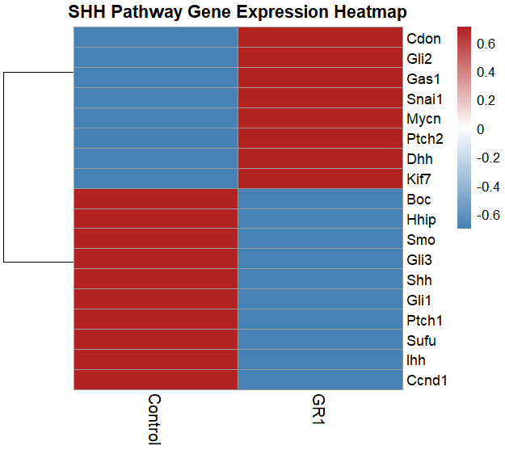
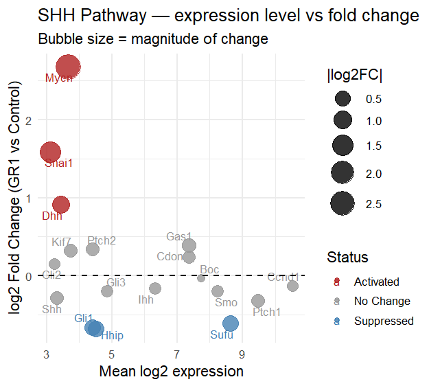
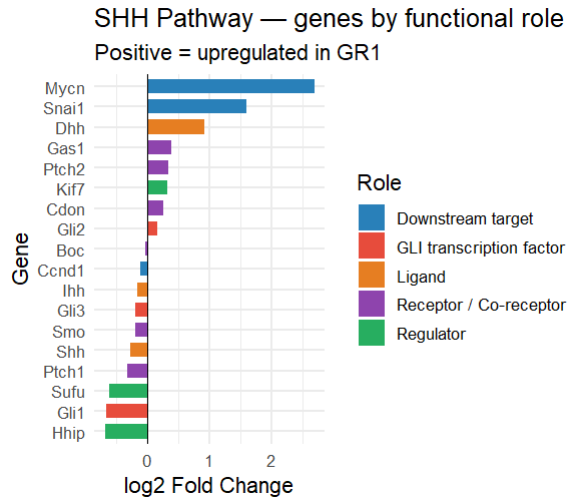
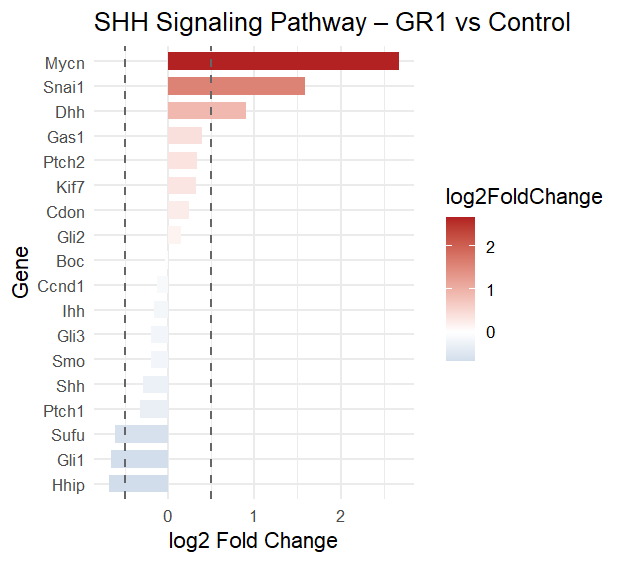
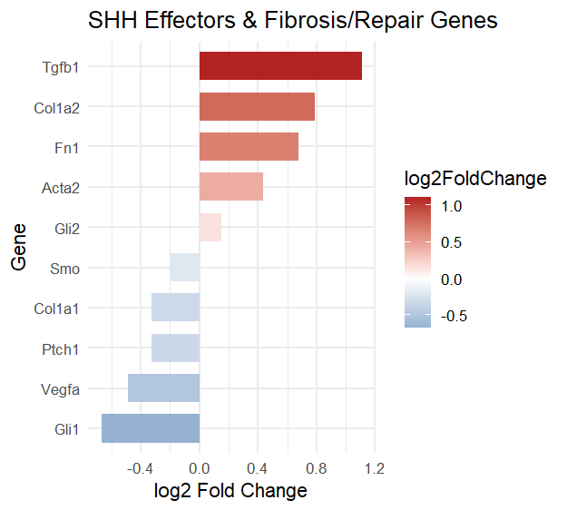
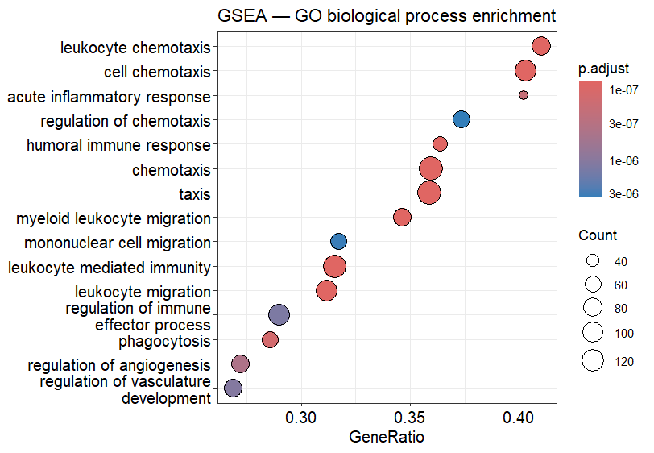
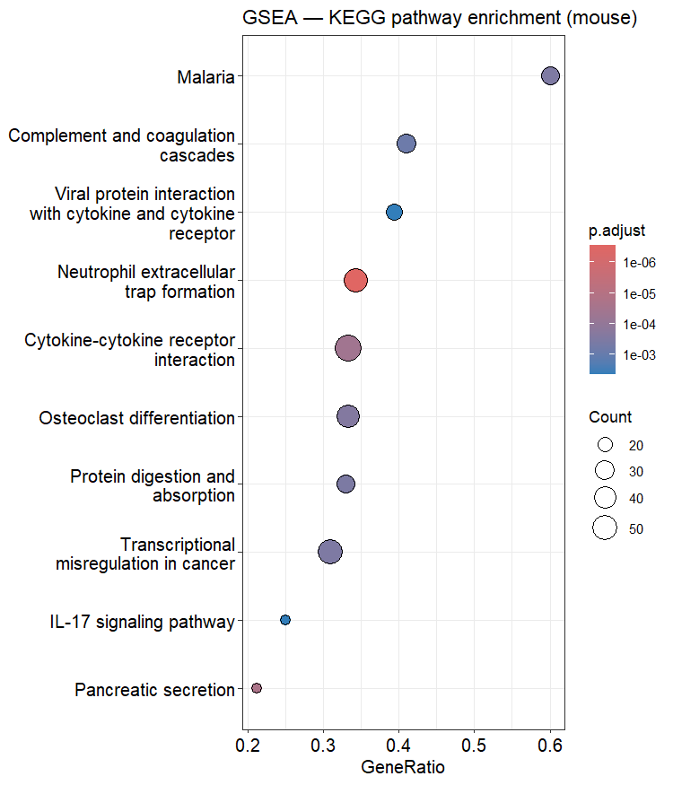
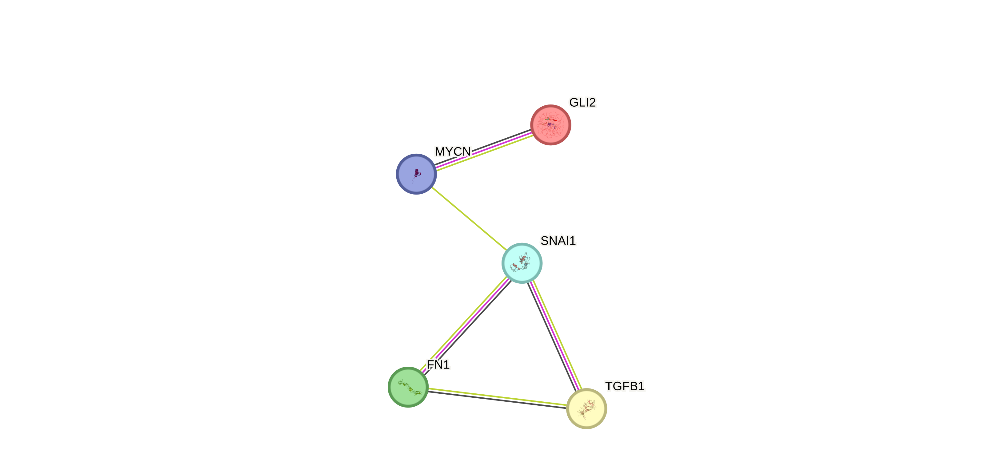

# shh-rnaseq-fibrosis-analysis
# SHH RNA-seq Pathway Analysis in Fibrosis & Repair

RNA-seq pathway-focused transcriptomic analysis of the Sonic Hedgehog (SHH) signaling pathway using mouse featureCounts data (Control vs GR1).

---

## Project Overview

This project investigates dysregulation of the Sonic Hedgehog (SHH) signaling pathway during fibrosis-associated tissue remodeling and repair using bulk RNA-seq count data.

The analysis was performed in RStudio using a featureCounts-generated count matrix derived from mouse RNA-seq samples.

Key objectives:

- Extract SHH pathway genes
- Analyze pathway activation/suppression
- Connect SHH signaling with fibrosis and repair
- Perform GO and KEGG enrichment analysis
- Visualize transcriptomic changes using multiple plot types

---

## Dataset

Input data:

- Mouse RNA-seq featureCounts output
- Samples:
  - Control
  - GR1

RNA-seq workflow:

Biological sample  
↓  
RNA extraction  
↓  
cDNA library preparation  
↓  
NGS sequencing  
↓  
FASTQ files  
↓  
Genome alignment  
↓  
BAM files  
↓  
featureCounts  
↓  
counts.txt

---

## Tools & Packages

### Software

- RStudio
- featureCounts

### R Packages

- ggplot2
- pheatmap
- ggrepel
- clusterProfiler
- enrichplot
- org.Mm.eg.db

---

## SHH Pathway Genes Analyzed

### Ligands
- Shh
- Ihh
- Dhh

### Receptors / Co-receptors
- Ptch1
- Ptch2
- Smo
- Gas1
- Cdon
- Boc

### Regulators
- Sufu
- Kif7
- Hhip

### GLI Transcription Factors
- Gli1
- Gli2
- Gli3

### Downstream Targets
- Mycn
- Snai1
- Ccnd1

---

## Key Findings

- Canonical SHH signaling markers (Gli1, Ptch1, Shh) were suppressed in GR1.
- Gli2, Mycn and Snai1 were upregulated, suggesting non-canonical SHH-associated remodeling.
- Fibrosis-associated genes including Tgfb1, Col1a1, Col1a2, Fn1 and Acta2 were elevated.
- GO and KEGG enrichment analyses indicated inflammatory and extracellular matrix remodeling processes.

Overall interpretation:

> GR1 samples exhibit inflammatory fibrotic remodeling associated with altered SHH pathway regulation.

---

## Genes present under Sonic Hedgehog (SHH) signalling pathway:

The repository includes processed transcriptomic results generated from the RNA-seq count matrix. The top 20 up and down regulated genes are mentioned as well as the SHH specific genes.

### Available CSV Files

- [SHH Gene Results](SHH_gene_results.csv)
- [Top 20 Upregulated Genes](Top20_Upregulated_Genes.csv)
- [Top 20 Downregulated Genes](Top20_Downregulated_Genes.csv)

### Example Results Preview

| Gene | log2FoldChange | Status |
|------|----------------|--------|
| Mycn | 2.45 | Activated |
| Snai1 | 1.52 | Activated |
| Gli1 | -0.63 | Suppressed |
| Hhip | -0.71 | Suppressed |

## Required codes to generate these files:

### Top 20 Upregulated Genes

```r
top20_up <- res_final[
  order(res_final$log2FoldChange,
        decreasing = TRUE),
][1:20, ]

write.csv(top20_up,
          "Top20_Upregulated_Genes.csv",
          row.names = FALSE)
```

### Top 20 Downregulated Genes

```r
top20_down <- res_final[
  order(res_final$log2FoldChange,
        decreasing = FALSE),
][1:20, ]

write.csv(top20_down,
          "Top20_Downregulated_Genes.csv",
          row.names = FALSE)
```

### SHH-only Gene Results

```r
write.csv(shh_data,
          "SHH_gene_results.csv",
          row.names = FALSE)
```

---

## Generated Visualizations

- SHH pathway heatmap
- Fold-change bar plots
- Functional category plots
- Bubble plots
- Fibrosis/repair pathway plots
- GO enrichment analysis
- KEGG pathway enrichment analysis
- 
## 1. SHH Pathway Gene Expression Heatmap



Row-scaled heatmap showing relative SHH pathway gene expression across Control and GR1 samples.

### Key observations

- Distinct separation between activated and suppressed SHH-associated genes
- Elevated Mycn and Snai1 expression in GR1
- Reduced Gli1 and Ptch1 expression

### Interpretation

The heatmap supports altered SHH pathway regulation and confirms fold-change trends observed in other analyses.

## 2. Fold-change bar plots



This plot visualizes differential expression of SHH pathway genes between GR1 and control samples using log2 fold change values.

### Key observations

- Strong activation of Mycn and Snai1
- Moderate activation of Gli2 and Dhh
- Suppression of Gli1 and Hhip

### Interpretation

The dataset indicates dysregulated SHH signaling with simultaneous suppression of canonical components and activation of fibrosis-associated effectors.

## 3. SHH Genes Grouped by Functional Role



Genes were grouped according to their functional role within the SHH signaling pathway.

### Categories included

- Ligands
- Receptors / Co-receptors
- GLI transcription factors
- Regulators
- Downstream targets

### Interpretation

The pathway appears functionally dysregulated, with suppression of canonical SHH signaling but continued activation of downstream remodeling-associated genes.

## 4. SHH Signalling Pathway Gene Expression



This plot shows the log2 fold change of SHH pathway-associated genes in GR1 relative to control samples.

### Key observations

- Dhh, Gli2, Mycn and Snai1 were upregulated
- Gli1, Ptch1, Hhip and Sufu were downregulated
- Mycn showed the strongest activation signal

### Interpretation

The expression pattern suggests suppression of canonical SHH signaling together with activation of remodeling-associated downstream targets.

## 5. SHH Effectors and Fibrosis/Repair Genes



This plot connects SHH pathway alterations with fibrosis and tissue repair-associated genes.

### Key observations

- Increased Tgfb1, Col1a1, Col1a2, Fn1 and Acta2 expression
- Gli2 activation associated with fibrosis markers
- Evidence of extracellular matrix remodeling

### Interpretation

The dataset suggests active fibrosis-associated tissue remodeling and inflammatory repair responses in GR1 samples.

## 6. GSEA GO Biological Process Enrichment



Gene Set Enrichment Analysis (GSEA) identified significantly enriched biological processes associated with GR1-upregulated genes.

### Enriched processes

- Leukocyte migration
- Chemotaxis
- Inflammatory response
- Angiogenesis regulation

### Interpretation

The transcriptome demonstrates activation of inflammatory and immune-associated remodeling pathways.

## 7. GSEA KEGG Pathway Enrichment



KEGG pathway enrichment analysis identified major signaling and remodeling pathways associated with GR1 samples.

### Enriched pathways

- Cytokine-cytokine receptor interaction
- IL-17 signaling
- Complement cascades
- Neutrophil extracellular trap formation

### Interpretation

The enrichment profile supports inflammatory fibrotic remodeling and altered SHH-associated signaling.

---

## STRING Protein Interaction Network



Protein interaction analysis was performed using the STRING database to investigate functional connectivity between key SHH-associated fibrosis and remodeling genes.

### Genes Included

- GLI2
- TGFB1
- FN1
- SNAI1
- MYCN

### Rationale for Gene Selection

These genes were selected because they represent interconnected components of SHH-associated fibrotic remodeling:

- GLI2 → non-canonical SHH transcriptional activation
- TGFB1 → central profibrotic signaling regulator
- FN1 → extracellular matrix remodeling
- SNAI1 → epithelial-mesenchymal transition (EMT)
- MYCN → SHH downstream proliferative target

### Interpretation

The interaction network demonstrates functional connectivity between SHH signaling effectors, fibrosis regulators and extracellular matrix remodeling genes, supporting the hypothesis of SHH-associated inflammatory fibrotic repair in GR1 samples.

---

## Repository Contents

| File | Description |
|------|-------------|
| `SHH_fibrosis.R` | Full R analysis pipeline |
| `counts.txt` | featureCounts RNA-seq count matrix |
| `SHH_analysis_report.pdf` | Internship assignment report |
| `plots/` | Generated figures |
| `results/` | Exported processed results |

---

## Skills Demonstrated

- RNA-seq transcriptomic analysis
- R programming
- Differential expression analysis
- Gene set enrichment analysis (GSEA)
- GO and KEGG pathway analysis
- Biological pathway interpretation
- Data visualization in ggplot2
- FeatureCounts count matrix processing
- Transcriptomic fibrosis analysis
  
---

## Limitations

- Only one control and one GR1 sample were available.
- Results are exploratory and not statistically conclusive due to lack of biological replicates.

---

## Author

 Arunabha Pal
 
 _St. Xavier’s College (Autonomous), Kolkata_
 
 Bsc Microbiology
 
 Internship Project — *Epigenomics Lab, University of Calcutta*
